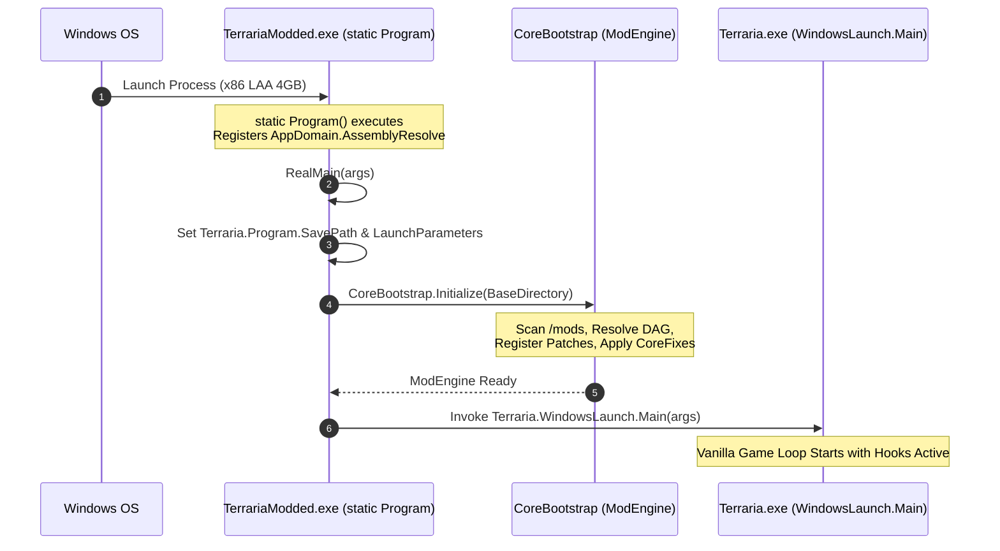

# 📐 TerrariaModCore (TMC) — Master Architectural & Technical Specification

**Version:** 1.0.0  
**Target Game:** Vanilla Terraria `1.4.5.8` / `1.4.5.7` (Steam & GOG Releases)  
**Target Framework:** `.NET Framework 4.8` (`net48`) | **Architecture:** `x86 (32-bit)` with `IMAGE_FILE_LARGE_ADDRESS_AWARE` (4GB Virtual Memory)  
**Core Patching Engine:** `Lib.Harmony 2.4.2` | **Inspection Engine:** `Mono.Cecil 0.11.5`  
**Status:** Official Standard | **Classification:** High-Performance Modular Runtime Engine  

---

## Table of Contents

1. [Executive Summary & Mission](#1-executive-summary--mission)
2. [Fundamental Architectural Invariants](#2-fundamental-architectural-invariants)
3. [Technology Stack & System Requirements](#3-technology-stack--system-requirements)
4. [High-Level Architecture & Layered Hierarchy](#4-high-level-architecture--layered-hierarchy)
5. [Subsystem Specifications](#5-subsystem-specifications)
   - 5.1 [Bootstrapper & Dynamic Assembly Resolver (`TerrariaModCore.Launcher`)](#51-bootstrapper--dynamic-assembly-resolver-terrariamodcorelauncher)
   - 5.2 [Public Modding API & Contracts (`TerrariaModCore.API`)](#52-public-modding-api--contracts-terrariamodcoreapi)
   - 5.3 [Host Engine & Lifecycle Manager (`TerrariaModCore`)](#53-host-engine--lifecycle-manager-terrariamodcore)
   - 5.4 [Topological Dependency Resolver & DAG Engine](#54-topological-dependency-resolver--dag-engine)
   - 5.5 [Centralized Patch & Conflict Management](#55-centralized-patch--conflict-management)
   - 5.6 [Configuration & Serialization Subsystem](#56-configuration--serialization-subsystem)
   - 5.7 [Logging & Observability Subsystem](#57-logging--observability-subsystem)
   - 5.8 [Pre-Render GraphicsDevice Race Protection (`CoreFixPatches`)](#58-pre-render-graphicsdevice-race-protection-corefixpatches)
6. [Plugin Manifest Specification (`manifest.json`)](#6-plugin-manifest-specification-manifestjson)
7. [Production Plugins Specification](#7-production-plugins-specification)
   - 7.1 [OreCascade (VeinMiner & Excavator)](#71-orecascade-veinminer--excavator)
   - 7.2 [AutoFishing (Native State Machine Fishing Automation)](#72-autofishing-native-state-machine-fishing-automation)
   - 7.3 [FishingLinePlus (Multi-Bobber Fishing Mechanics)](#73-fishinglineplus-multi-bobber-fishing-mechanics)
   - 7.4 [TurboExtractinator (Extraction Acceleration)](#74-turboextractinator-extraction-acceleration)
   - 7.5 [AutoBuff (Replenishment & Potion Management)](#75-autobuff-replenishment--potion-management)
   - 7.6 [AutoOpen (Container & Grab Bag Unpacker)](#76-autoopen-container--grab-bag-unpacker)
   - 7.7 [AutoResearch (Journey Mode Sacrifice Automation)](#77-autoresearch-journey-mode-sacrifice-automation)
   - 7.8 [PiggyVault (Piggy Bank Void Bag Integration)](#78-piggyvault-piggy-bank-void-bag-integration)
   - 7.9 [TurboBucket (60 TPS Liquid Pouring Acceleration)](#79-turbobucket-60-tps-liquid-pouring-acceleration)
   - 7.10 [BossCursor (Directional Indicator & Boss Head Pointer)](#710-bosscursor-directional-indicator--boss-head-pointer)
8. [Complete Runtime Hook & IL Interception Matrix (28 Hooks)](#8-complete-runtime-hook--il-interception-matrix-28-hooks)
9. [Multi-Mod Coexistence & Conflict Resolution Rules](#9-multi-mod-coexistence--conflict-resolution-rules)
10. [Build, Packaging, and Deployment Pipeline](#10-build-packaging-and-deployment-pipeline)
11. [Automated Verification & Testing Strategy (391 Tests)](#11-automated-verification--testing-strategy-391-tests)
12. [Plugin Authoring Protocol (Standard Operating Procedure)](#12-plugin-authoring-protocol-standard-operating-procedure)

---

## 1. Executive Summary & Mission

**TerrariaModCore (TMC)** is a high-performance, modular, zero-tModLoader runtime modding platform engineered specifically for official **Vanilla Terraria 1.4.5.8 / 1.4.5.7** releases (Steam & GOG). 

### Core Objectives
1. **Zero tModLoader Dependency**: Completely eliminates reliance on tModLoader, `ModPlayer`, `ModTile`, `ModContent`, or external loaders.
2. **100% Vanilla Disk Integrity**: Preserves the original `Terraria.exe` binary unmodified on disk (SHA256 verified). All game modifications occur strictly in volatile memory via Harmony runtime IL weaving.
3. **Pluggable Plugin Architecture**: Enables independent plugins to coexist, declare dependency trees, isolate configurations, manage their own life cycles, and operate without cross-mod side effects.
4. **Centralized Patch Governance**: Consolidates all IL hooks through a central engine, ensuring conflict detection, priority ordering, and atomic unpatching.
5. **Memory Limit Expansion (4GB LAA)**: Expands the native 32-bit virtual memory ceiling from 2GB to 4GB to permanently eliminate `System.OutOfMemoryException`.
6. **Operational Fault Containment**: Ensures that an exception in any single plugin is intercepted and isolated, allowing healthy plugins and the host game to run uninterrupted.

---

## 2. Fundamental Architectural Invariants

Every subsystem and plugin in the TMC ecosystem must strictly uphold the following invariants:

| Invariant ID | Rule Name | Description |
| :--- | :--- | :--- |
| **INV-01** | **Zero Disk Modification** | `Terraria.exe` and official game assets on disk must never be modified, patched, or overwritten. Runtime changes must occur exclusively in memory. |
| **INV-02** | **Centralized Harmony Control** | Plugins must **NEVER** instantiate private `new Harmony("...")` instances. All hooks must register via `IModContext.PatchManager`. |
| **INV-03** | **Large Address Aware (LAA)** | The compiled bootstrapper `TerrariaModded.exe` must have the PE header flag `IMAGE_FILE_LARGE_ADDRESS_AWARE` (`0x0020`) set (`Characteristics = 0x0122`). |
| **INV-04** | **Reentrancy Protection** | Any hook that invokes vanilla methods capable of triggering recursion (e.g. `Player.PickTile` or `Player.ItemCheck_Shoot`) must employ a `[ThreadStatic]` reentrancy guard. |
| **INV-05** | **Fault Isolation & Safe Mode** | Plugin lifecycle operations (`Initialize`, `Load`, `Unload`) and runtime hooks must execute inside guarded boundaries. A plugin crash must mark the plugin as `Faulted` without crashing the game. |
| **INV-06** | **Strict Infrastructure/Gameplay Separation** | Core projects (`TerrariaModCore`, `TerrariaModCore.API`, `TerrariaModCore.Launcher`) must remain 100% gameplay-agnostic. All game mechanics belong exclusively in plugins. |
| **INV-07** | **JIT Assembly Resolution Boundary** | `AppDomain.AssemblyResolve` must be configured in the static constructor `static Program()` before JIT compilation touches any `Terraria.*` types. Runtime execution occurs in a non-inlined `RealMain()` method. |
| **INV-08** | **GraphicsDevice Race Protection** | TMC Core must intercept `CaptureManager` to safely defer camera allocation when XNA `GraphicsDevice` is uninitialized during early pre-render initialization. |
| **INV-09** | **Mandatory Post-Build Deployment** | Every release compilation must automatically synchronize assembled artifacts from `dist/` into the target game directory. |

---

## 3. Technology Stack & System Requirements

```text
┌────────────────────────────────────────────────────────────────────────┐
│                              TARGET ENVIRONMENT                        │
├──────────────────────────┬─────────────────────────────────────────────┤
│ Target Game              │ Vanilla Terraria 1.4.5.8 / 1.4.5.7          │
│ Game Architecture        │ x86 (32-bit Architecture)                   │
│ Target Framework         │ .NET Framework 4.8                          │
│ Memory Configuration     │ 4 GB Virtual Address Space (LAA Enabled)    │
│ Graphics Framework       │ Microsoft XNA Framework 4.0                 │
│ IL Patching Engine       │ Lib.Harmony 2.4.2                           │
│ Static Inspection Engine │ Mono.Cecil 0.11.5 (Test Suite)              │
│ Build Toolchain          │ MSBuild 17.0+ / .NET SDK 10.0+ / C# 7.3+    │
│ Supported OS             │ Windows 10 / 11 (64-bit recommended)        │
└──────────────────────────┴─────────────────────────────────────────────┘
```

---

## 4. High-Level Architecture & Layered Hierarchy

The TMC platform is structured in a four-tier decoupled architecture:

```text
+-------------------------------------------------------------------------+
|                  Tier 1: Bootstrapper & PE Host                         |
|  TerrariaModded.exe (LAA 4GB, Dynamic Assembly Resolver, Handover)      |
+-------------------------------------------------------------------------+
                                     │
                                     ▼
+-------------------------------------------------------------------------+
|                  Tier 2: Host Engine (TerrariaModCore)                  |
|  - ModEngine (Lifecycle Orchestrator & Bootstrapping)                   |
|  - DependencyResolver (Kahn's DAG Topological Sorter)                   |
|  - PatchManager (Harmony 2.4.2 Central Hub & Conflict Detector)         |
|  - ModLoader & ModRegistry (Discovery & State Tracking)                 |
|  - CoreFixPatches (Early GraphicsDevice Pre-Render Race Mitigation)     |
|  - CoreLogger & ModConfigManager (Diagnostics & Serialization)          |
+-------------------------------------------------------------------------+
                                     │
                                     ▼
+-------------------------------------------------------------------------+
|                  Tier 3: Public API (TerrariaModCore.API)               |
|  - Contracts: IMod, IModContext, IPatchManager, IConfigManager          |
|  - Services: ILogger, IEventBus, IGameServices, IModRegistry            |
|  - Models: ModManifest, ModState, PatchInfo, PatchPriority              |
+-------------------------------------------------------------------------+
                                     │
                                     ▼
+-------------------------------------------------------------------------+
|                  Tier 4: Production Plugins (src/mods/*)                |
|  OreCascade         AutoFishing        FishingLinePlus  TurboExtractinator|
|  AutoBuff           AutoOpen           AutoResearch     PiggyVault        |
|  TurboBucket        BossCursor         [3rd-Party Custom Plugins...]    |
+-------------------------------------------------------------------------+
```

---

## 5. Subsystem Specifications

### 5.1 Bootstrapper & Dynamic Assembly Resolver (`TerrariaModCore.Launcher`)

The launcher compiles to `TerrariaModded.exe`. It initializes the runtime environment before transferring execution to vanilla Terraria.



#### Assembly Resolution Pipeline
When the .NET CLR fails to locate an assembly, `AppDomain.CurrentDomain.AssemblyResolve` executes the following sequence:
1. Probe `<AppDir>/<AssemblyName>.dll` and `<AppDir>/<AssemblyName>.exe`.
2. Probe `<AppDir>/TMC/<AssemblyName>.dll`.
3. Probe `<AppDir>/TMC/libs/<AssemblyName>.dll`.
4. If `<AssemblyName>` is `Terraria`, load `<AppDir>/Terraria.exe`.
5. Probe embedded assembly resources within the loaded `Terraria.exe` binary.

#### PE Header Large Address Aware Patching
The LAA flag is applied directly to the compiled executable PE header:
- **Characteristics Offset**: Read 4-byte offset at `0x3C` (`PE Header Offset`), then navigate to `Offset + 4 (PE Signature) + 18 (Characteristics)`.
- **Bitwise Transformation**: `Characteristics = Characteristics | 0x0020`.
- **Result**: Expands addressable virtual memory from 2GB (`0x0102`) to 4GB (`0x0122`).

#### Garbage Collection Tuning (`App.config`)
```xml
<configuration>
  <runtime>
    <gcServer enabled="true" />
    <gcAllowVeryLargeObjects enabled="true" />
  </runtime>
</configuration>
```

---

### 5.2 Public Modding API & Contracts (`TerrariaModCore.API`)

The API project contains pure interfaces, contracts, and data structures with **zero external dependencies**.

#### Core Interface Contracts

```csharp
public interface IMod
{
    void Initialize(IModContext context);
    void Load();
    void Unload();
}

public interface IModContext
{
    string Id { get; }
    ModManifest Manifest { get; }
    string ModDirectory { get; }
    string ConfigDirectory { get; }
    ILogger Logger { get; }
    IConfigManager ConfigManager { get; }
    IPatchManager PatchManager { get; }
    IEventBus EventBus { get; }
    IGameServices GameServices { get; }
    string GameVersion { get; }
    string CoreVersion { get; }
}

public interface IPatchManager
{
    void RegisterAll(string modId, Assembly assembly);
    void RegisterPrefix(string modId, MethodBase original, MethodInfo prefix, PatchPriority priority = PatchPriority.Normal);
    void RegisterPostfix(string modId, MethodBase original, MethodInfo postfix, PatchPriority priority = PatchPriority.Normal);
    void RegisterTranspiler(string modId, MethodBase original, MethodInfo transpiler, PatchPriority priority = PatchPriority.Normal);
    void UnpatchAll(string modId);
    IReadOnlyList<PatchInfo> GetAllPatches();
    IReadOnlyList<PatchInfo> GetPatchesByMod(string modId);
    IReadOnlyList<PatchInfo> GetPatchesByTarget(MethodBase target);
}

public interface IConfigManager
{
    T Get<T>() where T : class, new();
    T Get<T>(string fileName) where T : class, new();
    void Save<T>(T config) where T : class;
    void Save<T>(T config, string fileName) where T : class;
}

public interface ILogger
{
    LogLevel MinimumLevel { get; set; }
    void Trace(string message);
    void Debug(string message);
    void Info(string message);
    void Warning(string message);
    void Error(string message, Exception exception = null);
    void Fatal(string message, Exception exception = null);
}
```

#### Plugin Lifecycle State Machine

```text
       ┌──────────────┐
       │  Discovered  │  (manifest.json located on disk)
       └──────┬───────┘
              │
              ▼
       ┌──────────────┐
       │  Validated   │───[Missing Dep / Cycle Detected]───► ┌──────────┐
       └──────┬───────┘                                      │  Failed  │
              │                                              └──────────┘
              ▼                                                    ▲
       ┌──────────────┐                                            │
       │ Initialized  │───[Unhandled Exception in Init]────────────┤
       └──────┬───────┘                                            │
              │                                                    │
              ▼                                                    │
       ┌──────────────┐                                            │
       │    Loaded    │───[Unhandled Exception in Load]────────────┘
       └──────┬───────┘
              │
              ▼ (Runtime Unpatch / Engine Shutdown)
       ┌──────────────┐
       │   Unloaded   │
       └──────────────┘
```

---

### 5.3 Host Engine & Lifecycle Manager (`TerrariaModCore`)

The host engine manages the complete modding lifecycle:
1. **Game Version Verification**: Validates whether the running Terraria binary matches target `1.4.5.8` / `1.4.5.7`.
2. **Core Fix Application**: Applies `CoreFixPatches` before mod discovery.
3. **Plugin Discovery**: Scans `<BaseDir>/mods/` for subfolders containing `manifest.json`.
4. **Dependency Resolution**: Calculates the topological load order via Kahn's algorithm.
5. **Context Instantiation**: Creates an isolated `ModContext`, `ModLogger`, and `ModConfigManager` for each plugin.
6. **Execution & Isolation**: Calls `IMod.Initialize()` and `IMod.Load()` inside guarded try-catch blocks.
7. **Diagnostics Presentation**: Displays a startup summary banner in the console and log file.

---

### 5.4 Topological Dependency Resolver & DAG Engine

The dependency resolver models all plugins as a Directed Acyclic Graph (DAG) $G = (V, E)$, where $V$ represents mods and $E$ represents dependency edges.

#### Resolution Algorithm (Kahn's Algorithm)
1. **Node Extraction**: Extract all discovered mod IDs.
2. **Constraint Processing**:
   - For `mod.Dependencies`, add edge `dependency -> mod`.
   - For `mod.LoadAfter`, add edge `otherMod -> mod` (if `otherMod` exists).
   - For `mod.LoadBefore`, add edge `mod -> otherMod` (if `otherMod` exists).
   - For `mod.OptionalDependencies`, add edge `optionalDep -> mod` (if `optionalDep` exists).
3. **Incompatibility Validation**: If `mod.IncompatibleWith` contains any active mod, resolution aborts with a descriptive conflict error.
4. **Indegree Computation**: Compute the in-degree of all vertices.
5. **Topological Sort**:
   - Enqueue all nodes with in-degree $= 0$.
   - While queue is non-empty, dequeue $u$, append $u$ to sorted list, and decrement in-degree for all neighbors $v$. If in-degree of $v$ becomes 0, enqueue $v$.
6. **Cycle Detection**: If the count of sorted nodes $< |V|$, a circular dependency exists. The engine pinpoints the cycle members and logs an error without crashing.

---

### 5.5 Centralized Patch & Conflict Management

TMC enforces centralized patch governance through `PatchManager.cs`, wrapping a single `Harmony("com.tmc.host.patcher")` instance:

```text
┌──────────────────────────────────────────────────────────────────────────┐
│                             IPatchManager Hub                            │
├────────────────────────────────┬─────────────────────────────────────────┤
│ Patch Registration             │ Tracks modId, original target, hook type│
│ Conflict Detection             │ Detects overlapping prefixes/postfixes  │
│ Priority Execution Ordering    │ High -> Normal -> Low                   │
│ Isolated Unpatching            │ UnpatchAll(modId) restores IL per-mod   │
└────────────────────────────────┴─────────────────────────────────────────┘
```

#### Shared Method Resolution & Non-Destructive Execution
When multiple plugins hook the same vanilla method (e.g. `Player.ItemCheck_Shoot` or `Player.Update`):
- All patches are registered under their respective `modId`.
- Execution order follows `PatchPriority`: `PatchPriority.High` executes before `PatchPriority.Normal`, which executes before `PatchPriority.Low`.
- Prefixes that return `bool` (controlling original method execution) must never skip the original method unless explicitly intended and documented.
- Calling `UnpatchAll(modId)` removes only the patches registered by that specific plugin, preserving all other plugins' active hooks.

---

### 5.6 Configuration & Serialization Subsystem

- **Storage Location**: `<GameRoot>/mods/<ModId>/config.json`.
- **Zero-Dependency JSON Engine**: Powered by `SimpleJson.cs`, providing reflection-based serialization and deserialization without requiring `Newtonsoft.Json`.
- **Automatic Fallback**: If `config.json` is missing or corrupted, TMC instantiates default configuration values, writes the JSON file to disk, and continues execution.
- **Core Host Config**: `<GameRoot>/TMC/config/core.json`.

---

### 5.7 Logging & Observability Subsystem

- **Master Log Sink**: `<GameRoot>/TMC/logs/tmc.log`.
- **Crash Log Sink**: `<GameRoot>/TMC/logs/crash.log` (captures unhandled AppDomain and TaskScheduler exceptions).
- **Log Format**: `[HH:mm:ss] [TMC:<ModId>] [Level] Message`.
- **Levels**: `Trace` (0), `Debug` (1), `Info` (2), `Warning` (3), `Error` (4), `Fatal` (5).

---

### 5.8 Pre-Render GraphicsDevice Race Protection (`CoreFixPatches`)

#### The Problem
During `Main.ClientInitialize()`, `LoadSettings()` invokes `Lighting.Initialize()` -> `LegacyLighting.Rebuild()`. This queries `CaptureManager.Instance.IsCapturing`, triggering the static constructor `CaptureManager..cctor()`. The constructor attempts to instantiate `new CaptureCamera(Main.instance.GraphicsDevice)`. However, XNA's `GraphicsDeviceManager` has not yet initialized `GraphicsDevice` (`null`), causing a fatal `NullReferenceException`.

#### The Fix
`CoreFixPatches.cs` injects Harmony prefixes on `CaptureManager` methods:
- If `GraphicsDevice == null` during early startup, camera allocation is safely bypassed, and `IsCapturing` returns `false`.
- When `GraphicsDevice` is fully created on the first render frame, `CaptureCamera` is instantiated lazily on demand.

---

## 6. Plugin Manifest Specification (`manifest.json`)

Every plugin must include a `manifest.json` file in its root directory.

### Schema Definition

```json
{
  "$schema": "http://json-schema.org/draft-07/schema#",
  "title": "TMC Plugin Manifest",
  "type": "object",
  "required": ["Id", "Name", "Version", "EntryAssembly", "EntryType"],
  "properties": {
    "Id": {
      "type": "string",
      "description": "Unique alphanumeric identifier for the mod (lowercase with underscores)."
    },
    "Name": {
      "type": "string",
      "description": "Human-readable display name of the plugin."
    },
    "Version": {
      "type": "string",
      "description": "Semantic version string (e.g. 1.0.0)."
    },
    "Author": {
      "type": "string",
      "description": "Author or development team name."
    },
    "Description": {
      "type": "string",
      "description": "Brief description of the plugin's functionality."
    },
    "EntryAssembly": {
      "type": "string",
      "description": "File name of the compiled mod assembly (e.g. MyMod.dll)."
    },
    "EntryType": {
      "type": "string",
      "description": "Full namespace and class name implementing IMod (e.g. MyMod.MyModEntry)."
    },
    "TargetGameVersion": {
      "type": "string",
      "default": "1.4.5.8",
      "description": "Target Terraria release version."
    },
    "CoreVersion": {
      "type": "string",
      "default": "1.0.0",
      "description": "Required TMC Core version."
    },
    "Enabled": {
      "type": "boolean",
      "default": true,
      "description": "Toggle to enable or disable the plugin without deleting files."
    },
    "Dependencies": {
      "type": "array",
      "items": { "type": "string" },
      "description": "Mandatory mod IDs required for this plugin to load."
    },
    "OptionalDependencies": {
      "type": "array",
      "items": { "type": "string" },
      "description": "Optional mod IDs that should load before this plugin if present."
    },
    "LoadBefore": {
      "type": "array",
      "items": { "type": "string" },
      "description": "Mod IDs that must load after this plugin."
    },
    "LoadAfter": {
      "type": "array",
      "items": { "type": "string" },
      "description": "Mod IDs that must load before this plugin."
    },
    "IncompatibleWith": {
      "type": "array",
      "items": { "type": "string" },
      "description": "Mod IDs that cannot coexist with this plugin."
    }
  }
}
```

---

## 7. Production Plugins Specification

The TMC framework includes 10 production plugins covering core automation, quality of life, and game mechanics enhancement:

```text
┌────────────────────────────────────────────────────────────────────────┐
│                        OFFICIAL PRODUCTION PLUGINS                     │
├─────────────────────┬───────────────────┬──────────────────────────────┤
│ 1. OreCascade       │ 2. AutoFishing    │ 3. FishingLinePlus           │
│ 4. TurboExtractin.  │ 5. AutoBuff       │ 6. AutoOpen                  │
│ 7. AutoResearch     │ 8. PiggyVault     │ 9. TurboBucket               │
│ 10. BossCursor      │                   │                              │
└─────────────────────┴───────────────────┴──────────────────────────────┘
```

---

### 7.1 OreCascade (VeinMiner & Excavator)
- **ID:** `ore_cascade` | **Assembly:** `OreCascade.dll` | **Entry:** `OreCascade.OreCascadeMod`
- **Purpose:** Instant chain-mining for ores, gems, and extractable blocks using iterative Breadth-First Search (BFS).
- **Key Mechanics:**
  - Hook: `Player.PickTile(int x, int y, int pickPower)` (Prefix & Postfix).
  - Iterative queue-based BFS traversal to prevent stack overflow on massive veins.
  - Strict pickaxe tier validation (verifies tool power matches ore hardness).
  - Configurable orthogonal / diagonal traversal and max block limits.
  - Drops generated legitimately via vanilla `WorldGen.KillTile` with drops enabled.
  - Reentrancy guarded via `[ThreadStatic] private static bool isCascading`.

---

### 7.2 AutoFishing (Native State Machine Fishing Automation)
- **ID:** `auto_fishing` | **Assembly:** `AutoFishing.dll` | **Entry:** `AutoFishing.AutoFishingMod`
- **Purpose:** 60 TPS native state machine fishing automation with semantic bite detection and auto-reel.
- **Key Mechanics:**
  - Hooks: `Player.Update(int)` (Postfix), `Player.ItemCheck_Shoot` (Postfix), `Player.ItemCheck_PullFishingBobbers` (Prefix).
  - Evaluates native bobber states: `ai[0] == 0f` (floating in water), `ai[1] < 0f && localAI[1] != 0f` (active bite with item hooked).
  - Automatically triggers `Player.ItemCheck_PullFishingBobbers` on bite detection.
  - Re-casts rod automatically after configurable delay if bait is available.

---

### 7.3 FishingLinePlus (Multi-Bobber Fishing Mechanics)
- **ID:** `fishing_line_plus` | **Assembly:** `FishingLinePlus.dll` | **Entry:** `FishingLinePlus.FishingLinePlusMod`
- **Purpose:** Enables multiple simultaneous functional fishing lines and bobbers per player.
- **Key Mechanics:**
  - Hooks: `Player.ItemCheck_Shoot` (Postfix), `Player.ItemCheck_PullFishingBobbers` (Prefix), `Projectile.AI_061_FishingBobber` (Postfix).
  - Spawns up to `MaxActiveFishingLines` (default 4) additional bobbers with configurable angular spread velocity (`SpreadAngleDegrees = 7.0`, `VelocitySpread = 0.08`).
  - Dual-layer catch synchronization: evaluates loot checks and bite state on all active bobbers owned by the player.
  - Fully compatible with `AutoFishing` (AutoFishing monitors and reels all active bobbers).

---

### 7.4 TurboExtractinator (Extraction Acceleration)
- **ID:** `turbo_extractinator` | **Assembly:** `TurboExtractinator.dll` | **Entry:** `TurboExtractinator.TurboExtractinatorMod`
- **Purpose:** Accelerates Extractinator and Chlorophyte Extractinator processing speed by a configurable multiplier.
- **Key Mechanics:**
  - Hook: `Player.PlaceThing_ItemInExtractinator(int, int)` (Postfix).
  - Reduces `player.itemTime` and `player.itemAnimation` by `SpeedMultiplier` (default 5x), clamped to 1-tick frame floor.
  - Supports batch extraction mode for massive block stacks.

---

### 7.5 AutoBuff (Replenishment & Potion Management)
- **ID:** `auto_buff` | **Assembly:** `AutoBuff.dll` | **Entry:** `AutoBuff.AutoBuffMod`
- **Purpose:** Automatically consumes buff potions, food, and flasks when active durations expire.
- **Key Mechanics:**
  - Hook: `Player.Update(int)` (Postfix).
  - Scans inventory, Void Bag, and Piggy Bank (via PiggyVault synergy) on a configurable tick interval.
  - Priority-based potion selection with non-wasteful threshold timers (`MinBuffTimeThresholdTicks`).
  - Configurable exclusion list for specialized buffs/items.

---

### 7.6 AutoOpen (Container & Grab Bag Unpacker)
- **ID:** `auto_open` | **Assembly:** `AutoOpen.dll` | **Entry:** `AutoOpen.AutoOpenMod`
- **Purpose:** Rapid continuous opening of grab bags, crates, oysters, boss bags, lockboxes, and presents on hold-right-click.
- **Key Mechanics:**
  - Hooks: `ItemSlot.RightClick(Item[], int, int)` (Prefix), `Player.Update(int)` (Postfix).
  - Arms continuous opening state upon hold-right-click (Extractinator-style unpacking).
  - Consumes containers at configurable rate (`OpenDelayTicks = 3`) with native audio feedback.

---

### 7.7 AutoResearch (Journey Mode Sacrifice Automation)
- **ID:** `auto_research` | **Assembly:** `AutoResearch.dll` | **Entry:** `AutoResearch.AutoResearchMod`
- **Purpose:** Automatically sacrifices and researches Journey Mode items upon inventory entry.
- **Key Mechanics:**
  - Hook: `Player.Update(int)` (Postfix).
  - Evaluates `CreativeItemSacrificesCatalog.Instance.SacrificeCountNeededByItemId`.
  - Preserves 100% of vanilla research quantity requirements with zero manual sacrifice clicks.
  - Emits native research sound effects and visual feedback.

---

### 7.8 PiggyVault (Piggy Bank Void Bag Integration)
- **ID:** `piggy_vault` | **Assembly:** `PiggyVault.dll` | **Entry:** `PiggyVault.PiggyVaultMod`
- **Purpose:** Upgrades the Piggy Bank with Void Bag capabilities (auto-pickup, direct crafting, quick actions, and info accessory sharing).
- **Key Mechanics:**
  - Intercepts 13 distinct vanilla methods (`Player.GetItem`, `Recipe.CollectItemsFromChests`, `Player.QuickHeal_GetItemToUse`, `Player.QuickMana_GetItemToUse`, `Player.QuickBuff`, `Player.ConsumeItem`, `Player.HasUnityPotion`, `Player.UpdateEquips`, `Player.RefreshInfoAccs`, etc.).
  - Redirects surplus item pickups to Piggy Bank when inventory is full.
  - Supplies ammo, bait, potions, and Wormhole teleports directly from Piggy Bank.
  - Broadcasts info accessory telemetry (GPS, Compass, DPS Meter, Radar, etc.) stored in Piggy Bank.

---

### 7.9 TurboBucket (60 TPS Liquid Pouring Acceleration)
- **ID:** `turbo_bucket` | **Assembly:** `TurboBucket.dll` | **Entry:** `TurboBucket.TurboBucketMod`
- **Purpose:** Instant 60 TPS liquid pouring, continuous flow, and bottomless bucket / sponge acceleration.
- **Key Mechanics:**
  - Hook: `Player.ItemCheck_UseBuckets(int)` (Postfix).
  - Eliminates the 10-tick vanilla delay on liquid placement, enabling 60 TPS fluid placement.
  - Accelerates Bottomless Water/Lava/Honey/Shimmer buckets and Super Absorbent Sponges.

---

### 7.10 BossCursor (Directional Indicator & Boss Head Pointer)
- **ID:** `boss_cursor` | **Assembly:** `BossCursor.dll` | **Entry:** `BossCursor.BossCursorMod`
- **Purpose:** Real-time screen-edge directional arrow and boss head pointer indicating active boss positions.
- **Key Mechanics:**
  - Hook: `Main.DrawInterface_36_Cursor()` (Postfix).
  - Detects active bosses, mini-bosses, and invasion targets using native NPC heuristics (`npc.boss || npc.type == ...`).
  - Excludes the 4 Lunar Celestial Pillars (Solar, Vortex, Nebula, Stardust) by default.
  - Calculates angle vector from screen center to boss world position, supporting inverted gravity physics.
  - Renders directional indicator arrow with boss head icon and proximity-based scaling/opacity.

---

## 8. Complete Runtime Hook & IL Interception Matrix (28 Hooks)

| Index | Component | Target Class | Target Method | Hook Type | Priority | Functional Role |
| :---: | :--- | :--- | :--- | :---: | :---: | :--- |
| **1** | **TMC Core** | `CaptureManager` | `.ctor()` | `Prefix` | `High` | Defers `CaptureCamera` allocation if `GraphicsDevice == null`. |
| **2** | **TMC Core** | `CaptureManager` | `get_IsCapturing` | `Prefix` | `High` | Returns `false` safely if camera is unallocated. |
| **3** | **TMC Core** | `CaptureManager` | `Capture(...)` | `Prefix` | `High` | Guarantees camera instance before capture routines. |
| **4** | **TMC Core** | `CaptureManager` | `DrawTick()` | `Prefix` | `High` | Guarantees camera instance before render tick. |
| **5** | **OreCascade** | `Player` | `PickTile(int, int, int)` | `Prefix` & `Postfix` | `Normal` | Evaluates mined tile, executes recursive iterative BFS vein mining. |
| **6** | **AutoFishing** | `Player` | `Update(int)` | `Postfix` | `Normal` | Evaluates fishing state machine, auto-cast, and bite timers. |
| **7** | **AutoFishing** | `Player` | `ItemCheck_Shoot(...)` | `Postfix` | `Normal` | Auto-cast detection and active bobber registration. |
| **8** | **AutoFishing** | `Player` | `ItemCheck_PullFishingBobbers(Item)` | `Prefix` | `Normal` | Auto-pull bite execution upon valid bite state. |
| **9** | **FishingLinePlus** | `Player` | `ItemCheck_Shoot(...)` | `Postfix` | `Normal` | Spawns additional bobber projectiles with angular spread. |
| **10** | **FishingLinePlus** | `Player` | `ItemCheck_PullFishingBobbers(Item)` | `Prefix` | `Normal` | Evaluates fishing loot table on all active bobbers before retraction. |
| **11** | **FishingLinePlus** | `Projectile` | `AI_061_FishingBobber()` | `Postfix` | `Normal` | Synchronizes bite states and splashing across all active bobbers. |
| **12** | **TurboExtractinator**| `Player` | `PlaceThing_ItemInExtractinator(...)` | `Postfix` | `Normal` | Scales down `itemTime`/`itemAnimation` and handles batch extraction. |
| **13** | **AutoBuff** | `Player` | `Update(int)` | `Postfix` | `Normal` | Evaluates missing buffs and replenishes potions from inventory/banks. |
| **14** | **AutoOpen** | `ItemSlot` | `RightClick(Item[], int, int)` | `Prefix` | `Normal` | Detects hold-right-click on grab bags/crates to arm auto-unpacking. |
| **15** | **AutoOpen** | `Player` | `Update(int)` | `Postfix` | `Normal` | Executes continuous container unpack loop at 20 ops/sec. |
| **16** | **AutoResearch** | `Player` | `Update(int)` | `Postfix` | `Normal` | Scans inventory/Void Bag and sacrifices Journey Mode items. |
| **17** | **PiggyVault** | `Player` | `GetItem(int, Item, GetItemSettings)`| `Postfix` | `Normal` | Redirects surplus inventory item pickups to Piggy Bank. |
| **18** | **PiggyVault** | `Player` | `ItemSpaceForCofveve(Item, ...)` | `Postfix` | `Normal` | Reports available capacity inside Piggy Bank. |
| **19** | **PiggyVault** | `Recipe` | `CollectItemsFromChests()` | `Postfix` | `Normal` | Incorporates Piggy Bank items into crafting recipe matrix. |
| **20** | **PiggyVault** | `Player` | `QuickHeal_GetItemToUse()` | `Postfix` | `Normal` | Allows Quick Heal to draw healing potions from Piggy Bank. |
| **21** | **PiggyVault** | `Player` | `QuickMana_GetItemToUse()` | `Postfix` | `Normal` | Allows Quick Mana to draw mana potions from Piggy Bank. |
| **22** | **PiggyVault** | `Player` | `QuickBuff_PickBestFoodItem()` | `Postfix` | `Normal` | Allows Quick Buff to consume food from Piggy Bank. |
| **23** | **PiggyVault** | `Player` | `QuickBuff()` | `Postfix` | `Normal` | Allows Quick Buff to consume buff potions from Piggy Bank. |
| **24** | **PiggyVault** | `Player` | `ConsumeItem(...)` | `Postfix` | `Normal` | Consumes ammo and bait from Piggy Bank during firing/fishing. |
| **25** | **PiggyVault** | `Player` | `HasUnityPotion()` | `Postfix` | `Normal` | Checks Piggy Bank for Wormhole Potions during teleportation. |
| **26** | **PiggyVault** | `Player` | `TakeUnityPotion()` | `Prefix` & `Postfix` | `Normal` | Consumes Wormhole Potion from Piggy Bank on teleport. |
| **27** | **PiggyVault** | `Player` | `UpdateEquips(int)` / `RefreshInfoAccs()` | `Postfix` | `Normal` | Broadcasts info accessory telemetry from Piggy Bank. |
| **28** | **TurboBucket** | `Player` | `ItemCheck_UseBuckets(...)` | `Postfix` | `Normal` | Accelerates liquid bucket pouring to 60 TPS and accelerates sponges. |
| **29** | **BossCursor** | `Main` | `DrawInterface_36_Cursor()` | `Postfix` | `Normal` | Renders directional pointer arrow and boss head pointer. |

---

## 9. Multi-Mod Coexistence & Conflict Resolution Rules

### Shared Target Interceptions & Synergies

1. **`AutoFishing` + `FishingLinePlus`**:
   - Both intercept `Player.ItemCheck_Shoot` and `Player.ItemCheck_PullFishingBobbers`.
   - `FishingLinePlus` spawns $N$ bobbers with angular spread; `AutoFishing` monitors all $N$ bobbers simultaneously. When any bobber registers a bite, `AutoFishing` triggers `ItemCheck_PullFishingBobbers`, and `FishingLinePlus` evaluates loot for all active bobbers.
   - **Result:** Fully synchronized multi-catch automated fishing.

2. **`AutoBuff` + `PiggyVault`**:
   - `AutoBuff` scans player inventory and invokes `Player.QuickBuff()`.
   - `PiggyVault` hooks `Player.QuickBuff()` and `QuickBuff_PickBestFoodItem()` to supply potions directly from the Piggy Bank.
   - **Result:** Automated buff replenishment drawing seamlessly from both inventory and Piggy Bank.

3. **`AutoOpen` + `AutoResearch`**:
   - `AutoOpen` unpacks crates and grab bags, generating item drops into the player's inventory.
   - `AutoResearch` immediately detects newly acquired items on the next tick and sacrifices researchable items in Journey Mode.
   - **Result:** Automated container unpack-and-research pipeline.

### Verified Coexistence Scenarios (16 Matrix Tests)
All 16 combinations (isolated plugins, pairs, and all 10 plugins simultaneously) are continuously verified in `ModCoexistenceTests.cs` with 0 conflicts and 100% clean unpatching.

---

## 10. Build, Packaging, and Deployment Pipeline

### Compilation Flow (`build_dist.ps1`)

```text
1. CLEAN & COMPILE
   MSBuild / dotnet build TerrariaModCore.sln -c Release -p:Platform="x86"
   ├── TerrariaModCore.API.dll
   ├── TerrariaModCore.dll
   ├── TerrariaModCore.Launcher (TerrariaModded.exe)
   ├── 10 Mod Assemblies (src/mods/*)
   └── TerrariaModCore.Tests.exe

2. AUTOMATED TEST SUITE EXECUTION
   Execute tests/TerrariaModCore.Tests/bin/Release/TerrariaModCore.Tests.exe
   └── Verify 391/391 Assertions Pass with 0 Failures

3. ASSEMBLE RELEASE DISTRIBUTION (dist/)
   ├── TerrariaModded.exe (LAA Patched 0x0020)
   ├── TerrariaModded.exe.config
   ├── 0Harmony.dll
   ├── TMC/
   │   ├── TerrariaModCore.dll
   │   ├── TerrariaModCore.API.dll
   │   ├── 0Harmony.dll
   │   ├── config/core.json
   │   └── logs/
   └── mods/
       ├── OreCascade/ (manifest.json, OreCascade.dll, config.json)
       ├── AutoFishing/ (manifest.json, AutoFishing.dll, config.json)
       ├── FishingLinePlus/ (manifest.json, FishingLinePlus.dll, config.json)
       ├── TurboExtractinator/ (manifest.json, TurboExtractinator.dll, config.json)
       ├── AutoBuff/ (manifest.json, AutoBuff.dll, config.json)
       ├── AutoOpen/ (manifest.json, AutoOpen.dll, config.json)
       ├── AutoResearch/ (manifest.json, AutoResearch.dll, config.json)
       ├── PiggyVault/ (manifest.json, PiggyVault.dll, config.json)
       ├── TurboBucket/ (manifest.json, TurboBucket.dll, config.json)
       └── BossCursor/ (manifest.json, BossCursor.dll, config.json, UI/Cursor.png)

4. PE HEADER LAA PATCHING
   Apply IMAGE_FILE_LARGE_ADDRESS_AWARE (0x0020) to dist/TerrariaModded.exe

5. TARGET GAME DIRECTORY DEPLOYMENT
   Auto-detect $env:TERRARIA_PATH or Steam/GOG install path
   Copy-Item -Path "dist/*" -Destination "$GameDir" -Recurse -Force
```

---

## 11. Automated Verification & Testing Strategy (391 Tests)

TMC includes a standalone test runner (`TerrariaModCore.Tests.exe`) executing 391 automated assertions across 6 categories:

```text
==========================================
     TerrariaModCore (TMC) Test Suite     
==========================================
[PASS] DependencyResolver: Linear chain resolution (A -> B -> C)
[PASS] DependencyResolver: LoadAfter and LoadBefore constraints
[PASS] DependencyResolver: Circular dependency cycle detection
[PASS] DependencyResolver: IncompatibleWith conflict rejection
[PASS] DependencyResolver: Missing dependency failure handling
[PASS] DependencyResolver: Optional dependency ordering
[PASS] PatchManager: Prefix & Postfix runtime registration
[PASS] PatchManager: Multi-mod shared method hook registration
[PASS] PatchManager: Priority execution ordering (High -> Normal -> Low)
[PASS] PatchManager: Isolated unpatching per modId
[PASS] FaultIsolation: Catastrophic mod exception isolation
[PASS] ConfigManager: JSON serialization and schema defaults
[PASS] Compatibility: Game version validation (1.4.5.8 / 1.4.5.7)
[PASS] OreCascade: Iterative BFS traversal & pickaxe power requirements
[PASS] AutoFishing: Native state machine & bite detection
[PASS] FishingLinePlus: Angular spread velocity & multi-catch loot sync
[PASS] TurboExtractinator: Speed scaling & batch extraction logic
[PASS] AutoBuff: Potion priority & non-wasteful threshold timers
[PASS] AutoOpen: Hold-right-click arming & unpack loop
[PASS] AutoResearch: Journey Mode sacrifice quotas & inventory scan
[PASS] PiggyVault: Routing, crafting integration, and quick actions
[PASS] TurboBucket: 60 TPS fluid placement & sponge absorption
[PASS] BossCursor: Directional math, pillar filter, and proximity scaling
[PASS] CoexistenceMatrix: All 16 Multi-Mod Coexistence Scenarios
==========================================
RESULTS: 391 PASSED, 0 FAILED
==========================================
```

---

## 12. Plugin Authoring Protocol (Standard Operating Procedure)

To create a new custom plugin for TMC, follow this standardized procedure:

### Step 1: Project Setup (`.csproj`)
Create a Class Library project targeting `.NET Framework 4.8` on `Platform=x86` referencing `TerrariaModCore.API.dll`, `0Harmony.dll`, and `Terraria.exe` (with `Private=False`).

### Step 2: Declare Manifest (`manifest.json`)
```json
{
  "Id": "custom_sample_mod",
  "Name": "Custom Sample Mod",
  "Version": "1.0.0",
  "Author": "Developer",
  "Description": "Demonstration TMC plugin.",
  "EntryAssembly": "CustomSampleMod.dll",
  "EntryType": "CustomSampleMod.SampleModEntry",
  "TargetGameVersion": "1.4.5.8",
  "Enabled": true,
  "Dependencies": [],
  "OptionalDependencies": [],
  "LoadBefore": [],
  "LoadAfter": [],
  "IncompatibleWith": []
}
```

### Step 3: Implement Lifecycle (`IMod`)
```csharp
using TerrariaModCore.API;

namespace CustomSampleMod
{
    public class SampleModEntry : IMod
    {
        public static SampleModEntry Instance { get; private set; }
        public IModContext Context { get; private set; }
        public SampleConfig Config { get; private set; }

        public void Initialize(IModContext context)
        {
            Instance = this;
            Context = context;
            Config = context.ConfigManager.Get<SampleConfig>();

            context.Logger.Info("Sample Mod Initialized.");
            if (Config.Enabled)
            {
                context.PatchManager.RegisterAll(context.Manifest.Id, GetType().Assembly);
            }
        }

        public void Load() => Context.Logger.Info("Sample Mod Active.");
        public void Unload() => Context.Logger.Info("Sample Mod Unloaded.");
    }

    public class SampleConfig
    {
        public bool Enabled { get; set; } = true;
        public int Multiplier { get; set; } = 2;
    }
}
```

### Step 4: Author Harmony Patches
```csharp
using HarmonyLib;
using Terraria;

namespace CustomSampleMod.Patches
{
    [HarmonyPatch(typeof(Player), "Update")]
    public static class PlayerUpdatePatch
    {
        [HarmonyPostfix]
        public static void Postfix(Player __instance, int i)
        {
            var mod = SampleModEntry.Instance;
            if (mod == null || !mod.Config.Enabled || i != Main.myPlayer || __instance.dead) return;

            // Custom gameplay modification logic
        }
    }
}
```

### Step 5: Test & Deploy
1. Build assembly: `dotnet build -c Release -p:Platform="x86"`.
2. Place folder in `<TerrariaDirectory>/mods/custom_sample_mod/`.
3. Launch `TerrariaModded.exe` and check `<TerrariaDirectory>/TMC/logs/tmc.log`.

---

## Document Revision Log

| Revision | Date | Author / Agent | Changes & Notes |
| :---: | :---: | :---: | :--- |
| **1.0.0** | 2026-08-24 | TMC Engineering Team / Antigravity | Initial formal architectural and technical specification established from `PROMPT.md` and repository implementation. |
